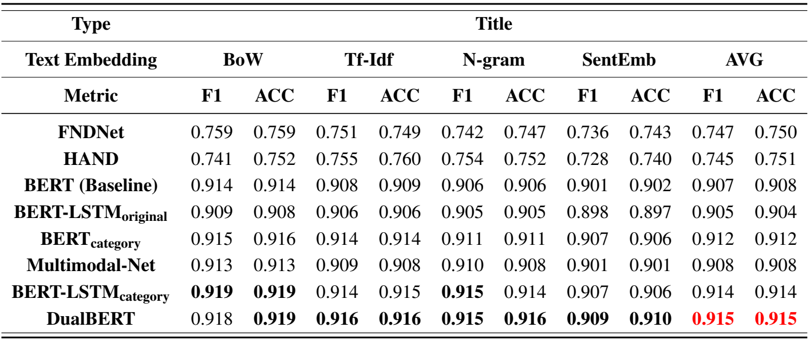
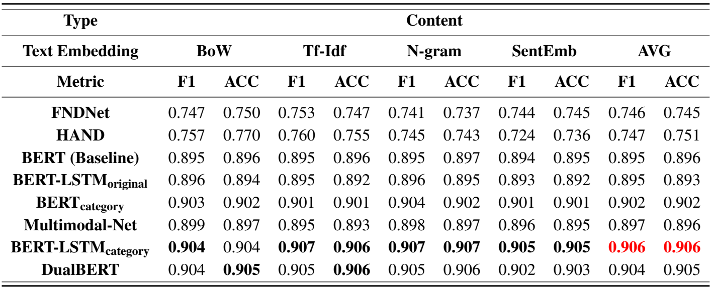

# Fake-News-Detection-Dataset

# Enviroments

- python 3.6.10

```
torch==1.8.0a0+17f8c32
konlpy==0.6.0
einops
gluonnlp==0.10.0
wandb==0.12.18
transformers==4.18.0
git+https://git@github.com/SKTBrain/KoBERT.git@master
```


**Computer Resources**
- **CPU**: i7-9800X
- **GPU**: RTX 2080Ti x 2
- **RAM**: 64GB
- **SSD**: 2TB x 2
- **OS**: ubuntu 18.04

**1. docker image**

1. docker hub를 통해서 docker image pull 하는 방법

```bash
docker pull dsbalab/fake_news
```

2. Dockerfile을 통해서 docker image 설치 방법

docker image 생성 시 `word-embedding`와 Part1과 Part2에 대한 `checkpoints` 가 함께 생성

```bash
cd ./docker
docker build -t $image_name .
```


**2. Korean word-embeddings**

본 프로젝트에서는 한국어 word embedding 모델로 `Mecab`을 사용

- 한국어 임베딩 [ [github](https://github.com/ratsgo/embedding) ]
- word-embeddings [ [download](https://drive.google.com/file/d/1FeGIbSz2E1A63JZP_XIxnGaSRt7AhXFf/view) ]


# Directory Tree

```
Fake-News-Detection-Dataset
.
├── data
│   ├── Part1
│   │   ├── train
│   │   │   ├── Clickbait_Auto
│   │   │   │   ├── EC
│   │   │   │   ├── ET
│   │   │   │   ├── GB
│   │   │   │   ├── IS
│   │   │   │   ├── LC
│   │   │   │   ├── PO
│   │   │   │   └── SO
│   │   │   ├── Clickbait_Direct
│   │   │   └── NonClickbait_Auto
│   │   ├── validation
│   │   └── train
│   └── Part2
│   │   ├── train
│   │   ├── validation
│   │   └── train
├── docker
├── docs
├── LICENSE
├── part1_title
├── part2_context
├── README.md
└── requirements.txt

```


# Part 1: 제목 - 본문 일치성 [ [Part1](https://github.com/TooTouch/Fake-News-Detection-Dataset/tree/0bb478f18ad83cec2104a6ff8eebe3ff9f7b4e7a/part1_title) ]

## Dataset
1. AI-Hub 낚시성 기사 탐지 데이터 다운로드 [[다운로드 링크](https://www.aihub.or.kr/aihubdata/data/view.do?currMenu=115&topMenu=100&aihubDataSe=realm&dataSetSn=71338#:~:text=%E2%80%BB%20%EB%82%B4%EA%B5%AD%EC%9D%B8%EB%A7%8C%20%EB%8D%B0%EC%9D%B4%ED%84%B0%20%EC%8B%A0%EC%B2%AD,%EC%9D%80%20%EB%B3%80%EA%B2%BD%20%EB%90%A0%20%EC%88%98%20%EC%9E%88%EC%8A%B5%EB%8B%88%EB%8B%A4.)] 

2. `./data`로 다음과 같은 데이터 폴더 구조 설정


3. `./clickbait_direct`내 가이드에 따라 데이터셋 변형 진행

## Baseline Models

- HAND[^1]
- FNDNet[^2]
- BERT[^3]

## Methods

- BERT<sub>category</sub>
- Multimodal-Net[^6]
- BERT-LSTM<sub>origina/categroy</sub>[^7]
- DualBERT[^8]

# Experiments
<div align="center">


</div>

# Reference

[^1]: Jeong, H. (2021). Hierarchical Attention Networks for Fake News Detection (Doctoral dissertation, The Florida State University).
[^2]: Kaliyar, R. K., Goswami, A., Narang, P., & Sinha, S. (2020). FNDNet–a deep convolutional neural network for fake news detection. Cognitive Systems Research, 61, 32-44.
[^3]: Devlin, J., Chang, M. W., Lee, K., & Toutanova, K. (2018). BERT: Pre-training of Deep Bidirectional Transformers for Language Understanding. NAACL-HLT (1), 4171-4186
[^4]: 전재민, 최우용, 최수정, & 박세영. (2019). BTS: 한국어 BERT 를 사용한 텍스트 세그멘테이션. 한국정보과학회 학술발표논문집, 413-415.
[^5]: 소규성, 이윤승, 정의석, & 강필성. (2022). KoBERTSEG: 한국어 BERT 를 이용한 Local Context 기반 주제 분리 방법론. 대한산업공학회지, 48(2), 235-248. 
[^6]: Shi, X., Mueller, J., Erickson, N., Li, M., & Smola, A. J. (2021). Benchmarking multimodal automl for tabular data with text fields. arXiv preprint arXiv:2111.02705. 
[^7]: Rai, N., Kumar, D., Kaushik, N., Raj, C., & Ali, A. (2022). Fake News Classification using transformer based enhanced LSTM and BERT. International Journal of Cognitive Computing in Engineering, 3, 98-105.
[^8]: Chu, Z., Stratos, K., & Gimpel, K. (2020). Unsupervised label refinement improves dataless text classification. arXiv preprint arXiv:2012.04194.
